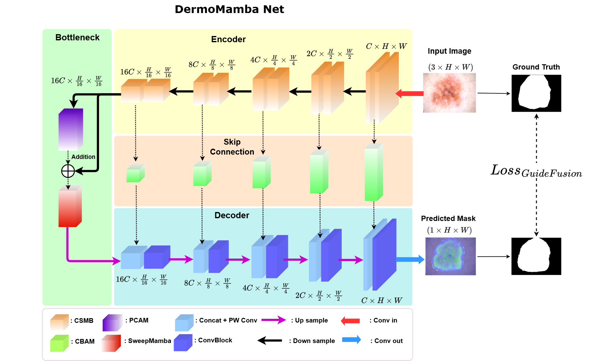
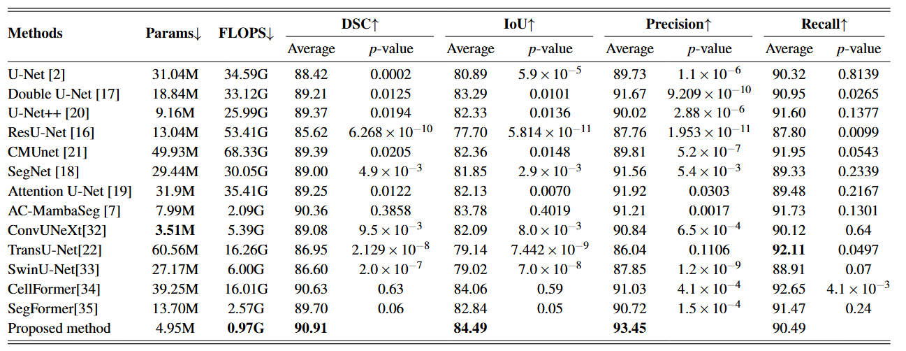
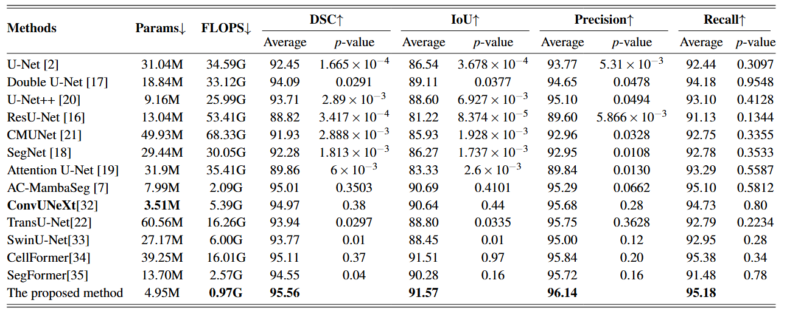

# [DermoMamba: A cross-scale Mamba-based model with Guide Fusion Loss for skin lesion segmentation in dermoscopy images](https://link.springer.com/article/10.1007/s10044-025-01506-w)


##  Abstract
In recent years, the application of artificial intelligence in medical image segmentation has garnered significant attention, particularly in the development of deep learning models aimed at improving accuracy and efficiency. Skin lesion segmentation is one of the most essential tasks in healthcare, serving as a crucial step in aiding the early detection of skin cancer, allowing physicians to develop appropriate and effective treatment plans for patients. In this research, we introduce a new compact U-shaped network design that integrates the local information extraction capability of Convolutional Neural Networks (CNNs) with the long-range dependency capturing ability of Mamba. Specifically, we introduce the Cross-Scale Mamba Block, a sequential architecture that effectively combines the ability to capture global features with an expanded receptive field and a bottleneck structure, which is enhanced with an optimized multiaxial Mamba mechanism for comprehensive spatial information aggregation. Additionally, the Convolutional Block Attention Module in the skip connections helps preserve information and enhance attention to important details. Furthermore, we introduce a new loss function, Guide Fusion Loss, which introduces an innovative attention map calculation to enhance segmentation accuracy at boundary regions in complex images. The proposed model, namely DermoMamba, is assessed using two datasets of dermoscopic skin lesion images, ISIC 2018 and PH2, achieving superior performance compared to advanced methods utilizing CNNs, Transformers and Mamba, while using fewer than 5 million parameters and less than 1 G floating point operations per second. This significant reduction in computational cost is achieved without compromising accuracy. Based on the experimental results, our model stands as an effective solution, striking a balance between accuracy and compactness. The code is made available at: https://github.com/hnkhai25/DermoMamba.

##  Key Contributions
- Propose **Cross-Scale Mamba Block** , which expands the receptive field and captures global features using a bottleneck-enhanced multiaxial Mamba mechanism.
- Apply **CBAM attention** in skip connections for enhanced focus on lesion boundaries.
- Introduce **Guide Fusion Loss** to improve edge-level segmentation via attention-guided supervision.
- Lightweight architecture with **<5M parameters** and **<1 GFLOPS**, suitable for deployment on low-resource devices.
## Overview of the DermoMamba network architecture


## Datasets

We evaluate DermoMamba on two widely-used dermoscopic skin lesion segmentation datasets:

- **ISIC 2018**: [https://challenge.isic-archive.com/](https://challenge.isic-archive.com/)
- **PH2**: [https://www.fc.up.pt/addi/ph2%20database.html](https://www.fc.up.pt/addi/ph2%20database.html)

## Results Summary
- Achieves superior performance compared to state-of-the-art CNN, Transformer, and Mamba-based models on **ISIC 2018** and **PH2** datasets.  
- Maintains high segmentation accuracy with significantly reduced computational cost.

### Table 1: Quantitative Results on ISIC 2018



### Table 2: Quantitative Results on PH2




## Citation
If you find this helpful, please cite it here:

```bibtex
@article{Hoang2025DermoMamba,
  title     = {DermoMamba: a cross-scale Mamba-based model with guide fusion loss for skin lesion segmentation in dermoscopy images},
  author    = {Ngoc-Khai Hoang and Dinh-Hieu Nguyen and Thi-Thao Tran and Van-Truong Pham},
  journal   = {Pattern Analysis and Applications},
  volume    = {28},
  year      = {2025},
  article   = {128},
  doi       = {10.1007/s10044-025-01506-w}
}

